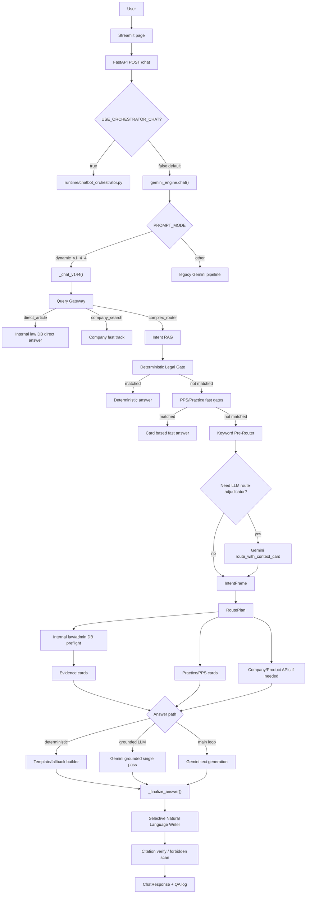

# 챗봇 아키텍처 및 답변 생성 흐름

작성일: 2026-05-12

검토 기준: 현재 작업트리의 코드와 설정 파일 기준. 운영 서버의 실제 환경변수 파일(`/opt/advisor/.env`)과 Vertex 콘솔 리소스는 이 문서에서 직접 조회하지 못했으므로, 코드로 확인 가능한 사실과 설정 파일에 기록된 사실을 구분한다.

## 1. 핵심 결론

현재 챗봇은 "LLM + RAG만으로 답하는 구조"가 아니다. 실제 구조는 다음에 가깝다.

```text
사용자 질문
  -> API Gateway
  -> Query Gateway / Normalizer / Keyword Router / Intent RAG
  -> 조건부 LLM Route Adjudicator
  -> IntentFrame / RoutePlan
  -> 내부 법령 DB, 행정규칙 DB, 실무카드, 조달청 Q&A, 업체 API 조회
  -> 결정형 답변 또는 Gemini 문장화
  -> 자연어 Writer, 인용 검증, 금지표현 스캔
  -> API 응답
```

코드 기준으로 보면 LLM은 현재 질문 의도 파악의 "항상 켜진 1차 분석기"가 아니다. `dynamic_v1_4_4` 경로에서는 로컬 규칙, 정규화, Keyword Router, Intent RAG가 먼저 작동하고, 충돌이나 저신뢰가 있을 때만 `GeminiIntentRouter.route_with_context_card()`가 조건부 검수자로 개입한다.

답변 품질을 자연스럽게 만드는 쪽에서는 `NATURAL_LANGUAGE_WRITER`가 의미가 있다. 다만 이것도 후처리 단계라서, 앞단에서 질문 맥락을 잘못 잡거나 잘못된 근거를 가져오면 Writer만으로는 본질적 오답을 고치기 어렵다.

## 2. 운영 진입점

### 2.1 Streamlit UI

사용자 화면은 `app/pages/💬_법령챗봇.py`에서 API를 호출한다.

- 기본 API URL: `http://127.0.0.1:8001/chat`
- 사용자 질문, 기관유형, 대화이력 등을 `POST /chat`으로 보낸다.
- 프론트엔드는 답변 생성 로직을 직접 수행하지 않는다.

### 2.2 FastAPI 서버

`app/api_server.py`가 API 진입점이다.

주요 엔드포인트:

- `POST /chat`: 일반 답변 생성
- `POST /chat/stream`: 진행상태 SSE 스트림. 최종 답변은 동일한 `/chat` 파이프라인을 사용한다.
- `GET /health`: 기본 헬스체크
- `GET /rag/status`: Chroma 및 Intent RAG 상태
- `GET /admin/health/routing`: 라우팅/데이터 파일/LLM 설정 상태
- `GET /qa-logs`, `/qa-summary`, `/qa-feedback`: QA 로그 확인

`/chat`의 1차 분기는 `USE_ORCHESTRATOR_CHAT`이다.

```text
USE_ORCHESTRATOR_CHAT=true
  -> app.runtime.chatbot_orchestrator.run_chatbot_runtime()

USE_ORCHESTRATOR_CHAT=false 또는 미설정
  -> gemini_engine.chat()
```

코드 기본값은 `false`다. 따라서 운영 서버의 `/opt/advisor/.env`가 별도로 `USE_ORCHESTRATOR_CHAT=true`를 넣지 않았다면 현재 기본 경로는 `gemini_engine.chat()`이다.

## 3. 런타임 모드

`gemini_engine.chat()` 내부에서 다시 `PROMPT_MODE`로 분기한다.

| 설정 | 실제 경로 | 설명 |
| --- | --- | --- |
| `PROMPT_MODE=dynamic_v1_4_4` | `_chat_v144()` | 현재 주력 동적 파이프라인 |
| 그 외 | legacy 경로 | 기존 system prompt 기반 경로 |

로컬 `.env`에는 `PROMPT_MODE=dynamic_v1_4_4`가 있다. 서버 서비스 파일 `busan-advisor-pilot.service`는 `/opt/advisor/.env`를 읽고 추가로 일부 환경변수를 override한다.

운영 서비스 파일에서 확인되는 주요 override:

| 항목 | 값 | 의미 |
| --- | --- | --- |
| `EVIDENCE_CONTEXT_MODE` | `card` | 내부 DB 근거를 LLM에 raw 원문보다 카드 형태로 압축 전달 |
| `LLM_TOOL_LOOP_ENABLED` | `false` | Gemini function-calling 도구 루프 비활성화 |
| `GEMINI_ROUTER_USE_VERTEX` | `true` | 라우터 LLM은 자격증명 존재 시 Vertex AI 사용 |
| `GEMINI_ROUTE_ADJUDICATOR_TIMEOUT_SEC` | `6` | 조건부 LLM 라우터 검수 timeout |
| `GEMINI_GROUNDED_THINKING_BUDGET` | `0` | DB 근거 기반 답변의 thinking budget 비활성 |
| `GEMINI_COMPLEX_THINKING_BUDGET` | `0` | 복합 답변의 기본 thinking budget 비활성 |

로컬 `.env`에는 `NATURAL_LANGUAGE_WRITER_ENABLED=true`, `NATURAL_LANGUAGE_WRITER_MODE=selective`, `LLM_TOOL_LOOP_ENABLED=false`가 있다. 실제 운영 서버는 `/opt/advisor/.env`와 service override의 합성 결과로 판단해야 한다.

## 4. 전체 흐름 다이어그램



## 5. 단계별 상세

### 5.1 Query Gateway

파일: `app/router/query_gateway.py`

역할:

- 명확한 직접 조문 조회
- 명확한 표준 카드형 질문
- 순수 업체 후보 검색
- 그 외 복합 사안은 뒤 단계로 넘김

중요한 점:

- Gateway는 모든 질문을 이해하려고 하지 않는다.
- 금액, 품목, 계약 가능 여부가 섞인 사안형 질문은 대체로 `complex_router`로 보낸다.
- 이 단계는 LLM을 호출하지 않는다.

### 5.2 Intent RAG

파일: `app/router/intent_rag_resolver.py`

역할:

- `app/data/intent_rag_corpus.json`
- `app/data/practice_manual_cards.json`
- 코드 내 curated examples

위 자료에서 유사 질문과 실무카드를 찾아 `IntentRagDecision`을 만든다.

반환하는 주요 값:

- `intent_labels`
- `sub_intents`
- `answer_mode`
- `confidence`
- `company_search_required`
- `company_search_blocked`
- `local_purchase_support_required`
- `contract_review_required`
- `legal_basis_required`

중요한 점:

- Intent RAG는 최종 답변 생성기가 아니다.
- 법령 정답을 판단하는 엔진도 아니다.
- 질문 맥락을 "힌트 카드"로 바꾸어 라우팅과 검색 범위를 보강하는 역할이다.
- 따라서 Intent RAG가 잘못된 유사 질문을 잡으면 뒤 단계 label이 기울 수 있다.

### 5.3 Deterministic Legal Gate

파일: `app/policies/deterministic_legal_answer_gate.py`

역할:

- 반복되는 법령 기준, 수의계약 한도, 부가세 기준, 혁신제품, 분할발주 등 표준 질문을 코드화된 템플릿으로 즉시 답변한다.
- 이 단계에서 매칭되면 LLM 본문 생성 전에 종료된다.

장점:

- 속도가 빠르다.
- 법령 기준이 코드/DB 기준으로 고정되어 환각 위험이 낮다.

한계:

- 표현이 딱딱하거나 자연어 맥락을 덜 반영할 수 있다.
- 패턴 매칭이 과하거나 부족하면 사용자의 세부 의도와 어긋날 수 있다.

### 5.4 PPS Q&A / Practice Manual Fast Gates

관련 파일:

- `app/policies/pps_qa_cards.py`
- `app/policies/practice_manual_cards.py`
- 데이터: `app/data/pps_qa_cases.json`, `app/data/practice_manual_cards.json`

역할:

- 조달청 질의응답형 질문, 절차/개념/주의사항 질문을 LLM 도구 루프 전에 카드 기반으로 빠르게 답한다.
- 법령상 금액, 시행일, 최종 가능/불가 판단은 내부 법령 DB가 우선한다.

### 5.5 Keyword Pre-Router

파일: `app/prompting/keyword_pre_router.py`

역할:

- `config/keyword_routes.yaml`과 로컬 lexicon 기반으로 category를 부여한다.
- `company_search`, `item_purchase`, `service_contract`, `construction_contract`, `local_purchase_support`, `contract_review` 같은 label을 만든다.

중요한 점:

- 이 단계도 LLM이 아니다.
- Intent RAG 결과가 신뢰도 조건을 만족하면 Keyword 결과에 병합된다.

### 5.6 조건부 LLM Route Adjudicator

관련 파일:

- `app/router/llm_route_adjudicator.py`
- `app/router/gemini_intent_router.py`
- 호출 위치: `app/gemini_engine.py`의 `_chat_v144()`

역할:

- Normalizer, Keyword Router, Intent RAG 결과가 충돌하거나 신뢰도가 낮을 때만 작동한다.
- LLM에는 compact context card를 넘긴다.
- LLM은 최종 법률 답변을 쓰지 않고, routing JSON 후보만 반환한다.

중요 코드 정책:

- `llm_route_adjudicator.py` 주석: "The adjudicator is not a first-line router."
- `gemini_intent_router.py`의 `route_with_context_card()` 주석: latency-bounded final routing check이며 general-purpose answer generator가 아니다.

따라서 사용자가 기대하는 "처음부터 LLM이 질문 맥락을 깊게 읽고 답변 방향을 잡는 구조"와는 다르다. 현재 LLM 라우터는 보조 검수자에 가깝다.

### 5.7 IntentFrame / RoutePlan

파일: `app/router/route_resolver.py`

`IntentFrame`은 앞단 신호를 하나의 질문 이해 결과로 합친다.

주요 필드:

- `labels`
- `sub_intents`
- `amount`
- `item_name`
- `contract_object`
- `buyer_type`
- `company_search_required`
- `local_purchase_support_required`
- `contract_review_required`
- `legal_basis_required`
- `issue_tags`
- `confidence`

`RoutePlan`은 실행 계획이다.

주요 필드:

- `query_tier`
- `execution_mode`
- `answer_sections`
- `retrieval_needs`
- `evidence_topics`
- `company_search_mode`
- `quality_controls`

중요한 점:

- `route_resolver.py`는 질문을 처음부터 다시 분류하지 않는다.
- 앞단 결과를 실행계획으로 번역하는 deterministic layer다.
- 코드 주석에도 "does not re-classify the user question from scratch"라고 되어 있다.

### 5.8 내부 DB / MCP Preflight

관련 파일:

- `app/gemini_engine.py`의 `_execute_tier_2_mandatory_mcp()`
- `app/internal_law_lookup.py`
- `app/policies/legal_evidence_cards.py`
- 데이터: `app/data/law_articles_db.json`, `admin_rules_db.json`, `law_annexes_db.json`, `admin_rule_annexes_db.json`

역할:

- RoutePlan이 법령 근거를 요구하면 내부 법령/행정규칙 DB를 먼저 조회한다.
- 내부 DB hit가 부족하면 외부 MCP fallback을 사용할 수 있다.
- 조회 결과는 raw context 또는 evidence card로 압축되어 LLM/후처리에 전달된다.

중요한 점:

- 현재 주력 경로에서는 "법령 RAG"가 제거되어 있고, 법령은 내부 DB/MCP preflight가 담당한다고 주석 처리되어 있다.
- `EVIDENCE_CONTEXT_MODE=card`이면 LLM에 들어가는 법령 근거가 카드화된다.
- 운영 서비스 파일은 `card` 모드다. 로컬 기본값은 코드상 `shadow`다.

### 5.9 Prompt Assembly

파일: `app/prompting/prompt_assembler.py`

역할:

- `prompts/core.md`를 system instruction으로 둔다.
- 가변 정보는 dynamic context에 넣는다.
- Guardrail, Keyword 결과, Intent Router 결과, 조회 시점, 기관유형, API 상태, 사용자 질문, RAG/DB context를 합친다.

중요한 점:

- 이것은 우리 서버에서 Gemini에 텍스트 컨텍스트를 주입하는 방식이다.
- Vertex의 별도 datastore나 grounding tool을 자동으로 붙이는 코드는 여기서 확인되지 않는다.

## 6. 답변 생성 경로

동일한 질문이라도 앞단 분기에 따라 최종 답변 생성 방식이 달라진다.

| 경로 | LLM 본문 생성 | 대표 조건 | 결과 |
| --- | --- | --- | --- |
| Direct Article | 없음 | 특정 법령 조문 직접 조회 | 내부 DB 조문 답변 |
| Company Fast Track | 없음 또는 제한적 | 순수 업체 후보 요청 | 업체 후보표 중심 답변 |
| Deterministic Legal Gate | 없음 | 표준 법령 기준 질문 | 코드화 템플릿 답변 |
| PPS/Practice Fast Answer | 없음 | 실무 Q&A, 절차, 개념 질문 | 카드 기반 답변 |
| Simple Amount / Grounded Fallback | 없음 | 단순 금액/계약방법 질문 | 내부 DB 기반 결정형 답변 |
| Grounded Single-Pass LLM | 있음 | 내부 DB 근거가 있고 사안형 문장화가 필요한 경우 | Gemini가 근거를 읽고 1회 문장화 |
| Multi-route Fast Answer | 없음 | 금액+품목+지역구매 경로 질문, fast bypass | 법령/업체 API 결과 조합 |
| Main Gemini Loop | 있음 | 위 fast path로 종료되지 않은 경우 | Gemini 본문 생성. 단 `LLM_TOOL_LOOP_ENABLED=false`면 도구 호출은 제거됨 |

현재 `LLM_TOOL_LOOP_ENABLED=false`이면 Gemini function-calling 도구 루프는 꺼진다. 이 경우에도 preflight evidence와 dynamic context는 Gemini에 전달될 수 있지만, Gemini가 답변 중 추가 도구를 직접 호출하지는 않는다.

## 7. Finalize 단계

파일: `app/gemini_engine.py`의 `_finalize_answer()`

역할:

1. generation meta 병합
2. 법적 결론 허용 범위 계산
3. MCP/API 상태 반영
4. 법령 인용 검증
5. 금지 표현 탐지
6. raw tool name 은닉
7. 선택적 자연어 Writer 적용
8. API 상태 표시 추가
9. 대화 이력 업데이트
10. `_last_generation_meta` 저장

중요한 점:

- Writer는 여기서 적용된다.
- Writer 적용 후에도 금지 표현 잔존 여부, 법령 근거, source status 등이 meta에 남는다.
- API 응답의 많은 필드는 `get_last_generation_meta()`를 통해 채워진다.

## 8. LLM의 실제 역할

현재 코드 기준 LLM 개입 지점은 다음이다.

### 8.1 조건부 라우팅 검수

`_run_llm_route_adjudicator()`가 `GeminiIntentRouter().route_with_context_card()`를 호출한다.

- 항상 호출되지 않는다.
- Gateway fast exit이면 우회된다.
- Keyword/RAG/Normalizer가 충분히 명확하다고 판단되면 우회된다.
- timeout이 걸리면 기존 deterministic 신호로 계속 진행한다.

### 8.2 Grounded Single-Pass Answer

`_generate_grounded_single_pass_answer()`가 내부 DB/MCP context를 Gemini에 넣고 1회 문장화한다.

- 법령 근거는 내부 DB context가 우선이다.
- Gemini는 이 근거를 사용해 답변을 쓰는 writer 역할이다.

### 8.3 Main Gemini Text Generation

fast path로 종료되지 않은 경우 `assemble_prompt()` 결과를 Gemini에 보내 답변을 생성한다.

- `LLM_TOOL_LOOP_ENABLED=false`이면 function tools는 제거된다.
- 그러면 Gemini는 전달받은 context만 보고 답변한다.

### 8.4 Natural Language Writer

`_apply_natural_language_writer()`가 최종 답변 일부 또는 전체를 다듬는다.

적용 조건:

- `NATURAL_LANGUAGE_WRITER_ENABLED=true`
- `NATURAL_LANGUAGE_WRITER_MODE`가 off가 아님
- 입력 길이가 최소/최대 범위 안
- prior model 시간이 너무 길지 않음
- 짧은 답변, 내부 marker 정리, 표 앞 본문 다듬기 등 선택 조건 충족

중요한 한계:

- Writer는 새 법령, 새 수치, 새 결론을 만들면 안 된다.
- 따라서 질문 의도 자체가 잘못 잡힌 경우 Writer만으로는 구조적 오답을 해결하지 못한다.

### 8.5 Orchestrator 경로의 LLM Router

`USE_ORCHESTRATOR_CHAT=true`이면 `app/runtime/chatbot_orchestrator.py`가 사용된다.

이 경로는 `GeminiIntentRouter().route()`를 Stage 1에서 호출한다. 즉, 이 모드에서는 LLM이 더 앞단 intent router 역할을 한다.

다만 현재 API 기본값은 `USE_ORCHESTRATOR_CHAT=false`이고, `chatbot_orchestrator.py` 상단 주석도 일부 gateway/rule engine을 stub로 설명한다. 운영에서 이 경로를 켰는지는 서버 실제 env 확인이 필요하다.

## 9. RAG와 내부 DB의 역할 구분

현재 코드에서 "RAG"라는 말은 여러 계층을 섞어서 쓰고 있다. 실제 역할은 분리해서 봐야 한다.

| 이름 | 데이터 | 실제 역할 | 최종 법령 판단 가능 여부 |
| --- | --- | --- | --- |
| Intent RAG | `intent_rag_corpus.json`, practice cards, curated examples | 유사 질문 기반 intent/context 힌트 | 불가 |
| 내부 법령 DB | `law_articles_db.json`, `admin_rules_db.json`, annex DB | 법령/행정규칙 근거 조회 | 가능 |
| Evidence Cards | 내부 DB/MCP 조회 결과 | LLM에 줄 근거 압축 카드 | 근거 전달 |
| Practice Manual Cards | `practice_manual_cards.json` | 절차, 체크리스트, 실무 유의사항 | 최종 수치 판단 불가 |
| PPS Q&A Cards | `pps_qa_cases.json` | 조달청 Q&A 해석 보조 | 최신 법령 기준 우선 필요 |
| Chroma | `app/.chroma` | 레거시/제품/문서 검색 상태 확인 및 일부 검색 | 경로별로 다름 |

질문 맥락을 잘 이해해야 하는 영역은 Intent RAG 혼자 담당하기에는 부족하다. Intent RAG는 유사도 기반 힌트라서 "특허 보유 2억", "혁신제품 금액 제한", "사회적협동조합 5천만 원" 같은 복합 법령 질문에서 세부 법적 쟁점을 안정적으로 분해하는 엔진은 아니다.

## 10. Vertex AI와 Grounding에 대한 코드 기준 판단

코드에서 Vertex AI 사용은 확인된다.

- `app/gemini_engine.py`: `GOOGLE_APPLICATION_CREDENTIALS` 파일이 있으면 `genai.Client(vertexai=True, project=..., location=...)`
- `app/router/gemini_intent_router.py`: `GEMINI_ROUTER_USE_VERTEX=true`이고 credentials 파일이 있으면 router provider를 `vertex_ai`로 설정

하지만 코드 검색 기준으로 다음은 확인되지 않았다.

- Gemini 호출에 Vertex AI Search datastore ID를 붙이는 코드
- `RagCorpus` 또는 Vertex RAG corpus resource를 지정하는 코드
- `google_search` grounding tool을 붙이는 코드
- `retrieval`, `semantic_retriever`, `data_store`류 tool config를 Gemini request에 붙이는 코드

따라서 Vertex 콘솔에 업로드된 grounding 자료가 있더라도, 현재 repo 코드만 보면 이 앱이 Gemini 호출 때 그 자료를 명시적으로 연결한다고 보기 어렵다.

정리하면:

- Vertex AI "모델 호출 provider" 사용 가능성은 코드상 존재한다.
- Vertex AI "서버측 grounding/RAG datastore 결합"은 현재 코드에서 명시 연결을 찾지 못했다.
- 만약 Vertex 쪽에 별도 grounding이 구성되어 있다고 주장하려면, 실제 요청 payload 또는 Vertex console/datastore 연결 설정을 추가로 확인해야 한다.

## 11. 왜 질문을 엉뚱하게 이해할 수 있는가

현재 구조에서 오해가 생기는 대표 지점은 다음이다.

1. Query Gateway는 보수적이라 복합 질문을 대부분 뒤로 넘긴다.
2. Intent RAG는 유사 질문 기반이라, 표면어가 비슷한 다른 쟁점으로 label을 줄 수 있다.
3. Keyword Router는 단어 기반이라 "부산 업체", "수의계약", "제품", "용역" 같은 단어가 많을수록 다중 label이 생긴다.
4. LLM Route Adjudicator는 항상 호출되지 않는다.
5. 호출되더라도 최종 답변 writer가 아니라 routing JSON 검수자다.
6. Deterministic Gate가 먼저 맞으면 뒤의 LLM 문맥 분석은 거의 개입하지 않는다.
7. Natural Language Writer는 후처리라서 route/evidence 오류를 본질적으로 고치지 못한다.

즉, "질문 의도 파악 단계에서 LLM 역할이 약하다"는 문제의식은 코드 기준으로 타당하다.

## 12. 코드상 관측 가능한 메타데이터

`ChatResponse`는 답변만 반환하지 않고 다음 정보를 같이 제공한다.

- `model_selected`
- `model_decision_reason`
- `tier_resolved`
- `answer_schema_version`
- `mandatory_mcp_plan`
- `mandatory_mcp_executed`
- `evidence_cards`
- `internal_db_hit_count`
- `external_mcp_fallback_count`
- `intent_frame`
- `route_plan`
- `intent_rag_*`
- `llm_adjudicator_*`
- `mcp_context_mode_*`
- `llm_payload_*`
- `natural_language_writer_*`
- `tool_loop_gate_*`

운영 QA에서는 이 meta를 같이 봐야 "답변이 왜 이렇게 나왔는지" 추적할 수 있다. 사용자가 체감하는 답변 품질 문제는 답변 본문만 보면 원인을 알기 어렵고, 반드시 `intent_rag_labels`, `llm_adjudicator_called`, `route_plan`, `mandatory_mcp_executed`, `natural_language_writer_applied`를 같이 봐야 한다.

## 13. 현재 구조의 장단점

장점:

- 법령 기준을 LLM이 마음대로 만들지 않도록 내부 DB와 deterministic gate를 앞에 둔다.
- 표준 질문은 빠르고 안정적으로 처리한다.
- 업체 API, 조달 쇼핑몰, 인증/혁신 제품 검색을 계약 경로와 결합할 수 있다.
- QA meta가 매우 풍부하다.

단점:

- 질문 맥락 이해가 여러 deterministic 부품에 분산되어 있다.
- LLM이 early intent understanding에 제한적으로만 참여한다.
- RAG가 "질문 이해"와 "근거 검색"과 "답변 보조"로 혼용되어 운영자가 헷갈리기 쉽다.
- 결정형 템플릿은 정확성에는 유리하지만 자연어 설명 품질에는 한계가 있다.
- Writer가 selective라 모든 답변이 자연스럽게 다듬어지지는 않는다.
- Vertex grounding 자료가 실제 호출 payload에 붙는지 코드상 확인되지 않는다.

## 14. 개선 방향

### 14.1 LLM Context Analyzer 추가

현재 LLM Route Adjudicator보다 앞 또는 병렬 단계에 "질문 맥락 분석 전용 LLM"을 둘 수 있다.

단, 이 LLM은 답변을 쓰지 않고 다음 schema만 반환해야 한다.

```json
{
  "user_question_type": "case_judgment | concept_explanation | procedure | company_lookup | document_drafting",
  "contract_object": "goods | service | construction | mixed | unknown",
  "amount": 0,
  "amount_basis_needed": true,
  "policy_company_type": "women | disabled | social_enterprise | social_coop | none",
  "special_basis": ["patent", "innovation_product", "disaster", "academic_research"],
  "local_support_intent": true,
  "legal_basis_required": true,
  "answer_should_include": ["conclusion", "legal_basis", "checklist", "alternatives"],
  "must_not_answer_as": ["company_recommendation_only"],
  "confidence": 0.0,
  "reason": "short explanation"
}
```

이렇게 하면 LLM이 질문 의도를 깊게 읽되, 법령 수치나 최종 가능/불가 판단은 여전히 내부 DB와 rule layer가 담당한다.

### 14.2 LLM 분석은 병목을 줄이도록 제한

병목을 줄이는 방식:

- Flash 모델
- thinking budget 0
- timeout 1.5초에서 3초
- JSON only
- 질문과 앞단 deterministic signal만 전달
- 실패 시 기존 Keyword/RAG 경로로 fallback
- 내부 DB preflight와 병렬 실행 가능한 구조 검토

### 14.3 Intent RAG의 역할 재정의

Intent RAG는 "정답 근거"가 아니라 "라우팅 힌트"로 문서화하고, meta 명칭도 가능하면 `intent_context_retrieval`처럼 바꾸는 편이 혼선을 줄인다.

필요한 보강:

- 유사 질문 top match를 QA 로그에 더 잘 노출
- 잘못 잡힌 top match를 운영자가 corpus에서 수정할 수 있는 관리 흐름
- 복합 법령 질문용 negative examples 추가
- "특허", "혁신제품", "사회적협동조합", "부가세", "분할발주", "재난"처럼 법적 쟁점이 강한 질문은 일반 유사도보다 issue tag를 우선

### 14.4 Writer 정책 정리

자연스러운 답변 문제는 "답변 생성 전 질문 이해"와 "답변 생성 후 문장화"가 같이 필요하다.

권장:

- deterministic answer라도 사용자-facing 답변은 Writer 대상 확대
- 표, 법령명, 금액, 결론 문장은 freeze
- 설명 문단만 rewrite
- Writer 적용 여부를 QA에서 필수 확인
- Writer가 적용되지 않은 이유를 관리자 UI에 노출

### 14.5 Vertex Grounding 확인 항목

Vertex 쪽 grounding 자료를 실제로 쓰려면 다음 중 하나가 코드 또는 설정에 명시되어야 한다.

- Gemini request에 retrieval tool 또는 datastore reference 전달
- Vertex AI Search datastore ID 사용
- RAG corpus resource name 사용
- 요청/응답 metadata에서 grounding chunks 또는 citations 확인

현재 repo 코드에서는 이 연결이 보이지 않는다. 운영 서버에서 확인하려면 실제 request payload 로그 또는 Vertex console 설정을 봐야 한다.

## 15. 최종 판단

현재 챗봇은 법령 안전성과 도구 연동을 위해 복잡한 deterministic pipeline을 갖춘 구조다. 이 방향 자체는 공공조달 챗봇에는 타당하다.

다만 사용자가 지적한 "질문을 엉뚱하게 이해해서 답변이 어긋나는 문제"는 코드 기준으로도 발생 가능한 구조다. LLM은 현재 질문 이해의 핵심 엔진이라기보다 조건부 route 검수자와 최종 writer에 가깝다.

따라서 근본 개선은 모든 답변을 LLM에게 맡기는 것이 아니라, 다음처럼 역할을 재배치하는 것이다.

```text
LLM: 질문 맥락 분석과 최종 문장화
Rule/DB: 법령 수치, 가능/불가 판단, 근거 조회
Intent RAG: 유사 질문 힌트와 실무카드 연결
Gateway/RoutePlan: 실행계획과 안전장치
```

이 구조로 가면 기존 게이트웨이, 라우터, 내부 DB, 업체 API를 버리지 않으면서도 LLM의 장점인 자연어 맥락 이해를 더 앞단에서 활용할 수 있다.
