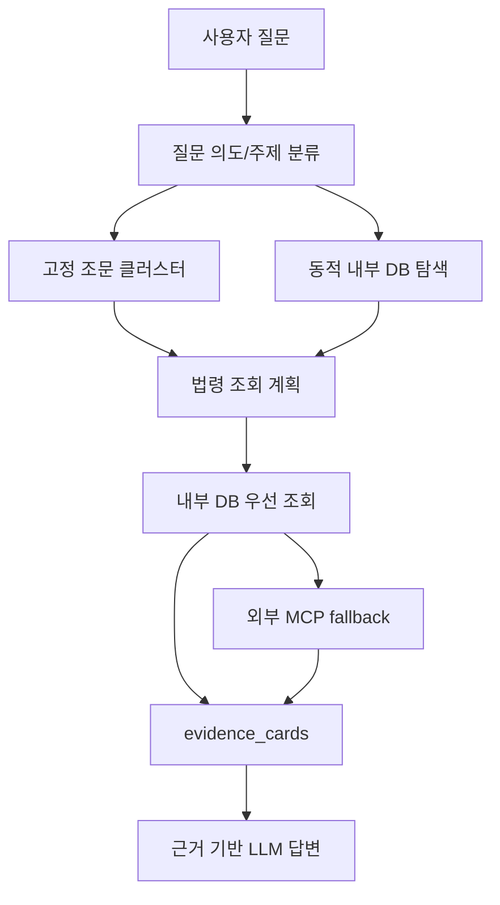

# 법령 조회 클러스터 운영 문서

작성일: 2026-05-08

이 문서는 챗봇이 질문을 받은 뒤 내부 법령 DB에서 어떤 근거를 조회하는지 확인하기 위한 운영 문서입니다.

현재 구조는 두 층으로 구성되어 있습니다.

1. **고정 조문 클러스터**
   - `app/topic_cluster_engine.py`에 하드코딩된 핵심 조문 묶음입니다.
   - "수의계약", "지역제한", "MAS", "우선구매"처럼 자주 묻는 조달 주제에 대해 반드시 조회해야 하는 법령과 조문을 지정합니다.

2. **동적 내부 DB 탐색**
   - `app/policies/internal_law_discovery.py`에서 내부 DB 전체를 대상으로 추가 관련 근거를 점수화해 보강합니다.
   - 외부 `korean-law-mcp`의 `findLaws()` 아이디어를 내부 DB용으로 축소 이식한 구조입니다.
   - 고정 클러스터를 대체하지 않고, 누락 가능성이 있는 근거를 보조로 추가합니다.

## 현재 조합에 대한 판단

현재로서는 이 조합이 가장 현실적인 운영안입니다.

| 방식 | 장점 | 약점 | 현재 역할 |
|---|---|---|---|
| 고정 조문 클러스터 | 필수 조문을 빠르고 안정적으로 조회 | 조문 변경 시 매핑 관리 필요 | 핵심 근거 보장 |
| 동적 내부 DB 탐색 | 표현이 다른 복합 질문에서 추가 근거 발굴 | 과잉탐색 가능성, 점수 튜닝 필요 | 누락 보완 |
| LLM | 질문 의미 파악과 실무형 문장화에 강함 | 법령 선택을 맡기면 환각 위험 | 의도 보조, 답변 문장화 |
| 외부 MCP fallback | 내부 DB에 없는 판례·해석례·별표 보완 | 속도/안정성/API 제한 문제 | 예외적 보조 |

따라서 지금 구조는 다음 원칙을 따릅니다.



## 유지보수 기준

### DB 재수집만 하면 되는 경우

- 조문번호는 그대로이고 본문만 개정된 경우
- 시행일자, 금액 기준, 문구가 바뀐 경우
- 행정규칙 본문이 개정되었지만 이름과 위치가 유지되는 경우

예: `지방계약법 시행규칙 제24조`의 금액 문구가 바뀐 경우

### 클러스터 매핑도 수정해야 하는 경우

- 핵심 기준 조문번호가 바뀐 경우
- 삭제 조문이 다른 조문으로 이동한 경우
- 새로운 고시·예규·규정이 핵심 근거가 된 경우
- 새로운 질문 주제에 대해 반드시 조회해야 할 근거가 생긴 경우

예: 수의계약 기준이 `시행령 제30조`가 아니라 다른 조문으로 이동한 경우

## 기관 유형별 기본 법령 체계

| 기관 유형 | 법률 | 시행령 | 시행규칙 | 주요 행정규칙 |
|---|---|---|---|---|
| 지방자치단체 | 지방계약법 | 지방계약법 시행령 | 지방계약법 시행규칙 | 지방자치단체 입찰 및 계약집행기준, 지방자치단체 입찰시 낙찰자 결정기준 |
| 국가기관 | 국가계약법 | 국가계약법 시행령 | 국가계약법 시행규칙 | (계약예규) 정부 입찰·계약 집행기준 |
| 공기업·준정부기관 | 국가계약법 | 국가계약법 시행령 | 국가계약법 시행규칙 | 공기업ㆍ준정부기관 계약사무규칙, 기타공공기관 계약사무 운영규정 |
| 출자출연·지방공기업 | 지방계약법 | 지방계약법 시행령 | 지방계약법 시행규칙 | 지방자치단체 입찰 및 계약집행기준, 지방자치단체 입찰시 낙찰자 결정기준 |

## 주제 감지 키워드

| 주제 ID | 의미 | 대표 키워드 |
|---|---|---|
| `direct_contract` | 수의계약 | 수의계약, 수의, 견적, 1인견적, 2인견적, 소액수의 |
| `bid` | 입찰·경쟁입찰 | 입찰, 경쟁입찰, 제한경쟁, 일반경쟁, 낙찰, 적격심사 |
| `price` | 예정가격·추정가격 | 예정가격, 추정가격, 기초금액, 원가계산, 낙찰률 |
| `joint_contract` | 공동계약·공동도급 | 공동계약, 공동도급, 공동수급, JV, 컨소시엄 |
| `mas` | MAS·종합쇼핑몰 | 종합쇼핑몰, MAS, 다수공급, 나라장터, 제3자단가 |
| `priority_purchase` | 우선구매·중소기업제품 | 우선구매, 의무구매, 중소기업제품, 직접생산, 경쟁제품, 중소기업자간 |
| `evaluation` | 가점·평가 | 가점, 배점, 평가기준, 신인도, 종합평가, 제안서평가 |
| `excellence` | 우수·혁신·기술개발제품 | 우수조달, 혁신제품, 기술개발, 성능인증, NEP, NET |
| `policy_company` | 정책기업 | 여성기업, 장애인기업, 사회적기업, 소기업, 소상공인 |
| `construction` | 공사 | 공사, 건설, 시공, 건축 |
| `service` | 용역 | 용역, 설계, 감리, 컨설팅, 엔지니어링, 위탁 |

## 계약 유형 감지 키워드

| 계약 유형 | 대표 키워드 |
|---|---|
| `goods` | 물품, 구매, 납품, 구입, 장비, 기자재, 컴퓨터, 가구, 차량, 프린터, 에어컨, 서버 |
| `construction` | 공사, 건설, 시공, 건축, 종합공사, 전문공사 |
| `service` | 용역, 설계, 감리, 컨설팅, 엔지니어링, 기술용역, 위탁, 대행 |

## 인접 주제 자동 보강

특정 주제가 감지되면 관련성이 높은 인접 주제의 핵심 조문도 함께 조회합니다.

| 감지 주제 | 함께 보강되는 주제 |
|---|---|
| `direct_contract` | `bid`, `price`, `excellence`, `policy_company`, `priority_purchase` |
| `bid` | `direct_contract`, `price` |
| `price` | `direct_contract`, `bid` |
| `joint_contract` | `bid` |
| `evaluation` | `bid` |
| `policy_company` | `direct_contract` |
| `excellence` | `direct_contract`, `priority_purchase` |
| `priority_purchase` | `direct_contract`, `excellence` |

## 고정 조문 클러스터

아래 표는 `app/topic_cluster_engine.py` 기준입니다.

### 수의계약 `direct_contract`

| 기관 | 핵심 법령·조문 | 행정규칙 |
|---|---|---|
| 지방자치단체 | 지방계약법 제9조, 지방계약법 시행령 제25조·제26조·제30조, 지방계약법 시행규칙 제28조·제29조·제30조 | 지방자치단체 입찰 및 계약집행기준 |
| 국가기관 | 국가계약법 제7조, 국가계약법 시행령 제26조·제27조·제30조, 국가계약법 시행규칙 제28조·제29조·제30조 | (계약예규) 정부 입찰·계약 집행기준 |
| 공기업·준정부기관 | 국가계약법 제7조, 국가계약법 시행령 제26조·제27조·제30조 | 공기업ㆍ준정부기관 계약사무규칙, 기타공공기관 계약사무 운영규정 |

계약 유형별 추가 조문:

| 계약 유형 | 지방자치단체 추가 조문 | 국가기관 추가 조문 |
|---|---|---|
| 물품 | 시행령 제25조·제30조 | 시행령 제26조·제30조 |
| 공사 | 시행령 제25조·제30조·제30조의2 | 시행령 제26조·제30조 |
| 용역 | 시행령 제25조·제30조 | 시행령 제26조·제30조 |

### 입찰·제한경쟁 `bid`

| 기관 | 핵심 법령·조문 | 행정규칙 |
|---|---|---|
| 지방자치단체 | 지방계약법 제9조·제12조·제13조·제14조, 시행령 제13조·제14조·제20조·제21조·제22조·제42조, 시행규칙 제24조 | 지방자치단체 입찰시 낙찰자 결정기준, 지방자치단체 입찰 및 계약집행기준 |
| 국가기관 | 국가계약법 제7조·제10조, 시행령 제14조·제21조·제22조·제42조, 시행규칙 제24조 | (계약예규) 정부 입찰·계약 집행기준 |
| 공기업·준정부기관 | 국가계약법 제7조·제10조, 시행령 제14조·제21조·제22조 | 공기업ㆍ준정부기관 계약사무규칙 |

계약 유형별 추가 조문:

| 계약 유형 | 지방자치단체 추가 조문 |
|---|---|
| 공사 | 시행령 제20조·제42조 |
| 용역 | 시행령 제20조·제42조 |

### 예정가격·원가계산 `price`

| 기관 | 핵심 법령·조문 | 행정규칙 |
|---|---|---|
| 지방자치단체 | 지방계약법 제6조, 시행령 제7조·제8조·제9조·제10조, 시행규칙 제5조·제6조 | 지방자치단체 입찰 및 계약집행기준 |
| 국가기관 | 국가계약법 제4조·제6조, 시행령 제7조·제8조·제9조·제10조, 시행규칙 제5조·제6조 | (계약예규) 정부 입찰·계약 집행기준 |
| 공기업·준정부기관 | 국가계약법 제4조·제6조, 시행령 제7조·제8조·제9조 | 공기업ㆍ준정부기관 계약사무규칙 |

### 공동계약·공동도급 `joint_contract`

| 기관 | 핵심 법령·조문 | 행정규칙 |
|---|---|---|
| 지방자치단체 | 지방계약법 제15조, 시행령 제74조·제75조·제76조 | (계약예규) 공동계약운용요령 |
| 국가기관 | 국가계약법 제25조, 시행령 제72조·제73조·제74조·제75조·제76조 | (계약예규) 공동계약운용요령 |
| 공기업·준정부기관 | 국가계약법 제25조, 시행령 제72조·제73조 | (계약예규) 공동계약운용요령 |

### MAS·종합쇼핑몰 `mas`

| 공통 핵심 법령·조문 | 행정규칙 |
|---|---|
| 조달사업법 제9조·제9조의2, 조달사업법 시행령 제14조·제15조·제16조 | 물품 다수공급자계약 업무처리규정, 국가종합전자조달시스템 종합쇼핑몰 운영규정 |

### 우선구매·중소기업제품 `priority_purchase`

| 공통 핵심 법령·조문 | 행정규칙 |
|---|---|
| 중소기업제품 구매촉진 및 판로지원법 제6조·제7조·제8조·제9조·제12조·제13조·제14조, 중소기업제품 구매촉진법 시행령 제7조·제8조·제9조·제10조 | 중소기업자간 경쟁제품 및 공사용자재 직접구매 대상 품목 지정 내역, 조달청 제조물품 직접생산확인 기준 |

### 가점·평가 `evaluation`

| 기관 | 핵심 법령·조문 | 행정규칙 |
|---|---|---|
| 지방자치단체 | 지방계약법 시행령 제42조 | 지방자치단체 입찰시 낙찰자 결정기준 |
| 국가기관 | 국가계약법 시행령 제42조 | (계약예규) 정부 입찰·계약 집행기준 |
| 공기업·준정부기관 | 별도 핵심 조문 없음 | 기타공공기관 계약사무 운영규정 |

### 우수·혁신·기술개발제품 `excellence`

| 공통 핵심 법령·조문 | 행정규칙 |
|---|---|
| 조달사업법 제9조의2 | 우수조달공동상표 물품 지정 관리규정, 혁신제품 구매 운영 규정, 중소기업기술개발제품 우선구매제도 운영 등에 관한 시행세칙 |

### 정책기업 `policy_company`

| 기관 | 핵심 법령·조문 | 행정규칙 |
|---|---|---|
| 지방자치단체 | 지방계약법 시행령 제25조·제30조 | 없음 |
| 국가기관 | 국가계약법 시행령 제26조·제30조 | 없음 |
| 공기업·준정부기관 | 별도 핵심 조문 없음 | 공기업ㆍ준정부기관 계약사무규칙 |

### 공사·용역 보조 주제

| 주제 | 행정규칙 |
|---|---|
| `construction` | (계약예규) 공사계약일반조건 |
| `service` | (계약예규) 용역계약일반조건, (계약예규) 용역입찰유의서 |

## 동적 내부 DB 탐색 보강층

동적 탐색은 `app/policies/internal_law_discovery.py`에서 수행합니다.

주요 역할:

- 질문에서 불필요한 단어를 제거합니다.
- `중기간`, `중소기업경쟁제품`, `성능인증`, `직접생산` 같은 표현을 표준 키워드로 확장합니다.
- 내부 DB의 법령명, 행정규칙명, 조문 제목, 조문 본문 앞부분을 점수화합니다.
- 고정 클러스터에 없는 근거 후보를 최대 8개까지 추가합니다.
- 기관 유형과 맞지 않는 공기업·국가기관 근거는 최대한 제외합니다.

예시:

| 질문 표현 | 동적 탐색이 보강할 수 있는 근거 |
|---|---|
| 성능인증 제품 | 중소기업기술개발제품 우선구매제도 운영 등에 관한 시행세칙, 중소기업제품 구매촉진법 시행령 제13조 |
| 중기간 경쟁 | 중소기업제품 구매촉진 및 판로지원법 제6조, 중소기업제품 구매촉진법 시행령 제6조 |
| 직접생산 확인 | 조달청 제조물품 직접생산확인 기준 |
| 혁신제품 | 혁신제품 구매 운영 규정, 조달사업법 제9조의2 |
| MAS·종합쇼핑몰 | 물품 다수공급자계약 업무처리규정, 국가종합전자조달시스템 종합쇼핑몰 운영규정 |

## 운영상 주의점

1. 고정 클러스터는 신뢰 가능한 핵심 근거 목록입니다. 임의로 삭제하면 답변 안정성이 떨어질 수 있습니다.
2. 동적 탐색은 보조 근거입니다. 과잉탐색 가능성이 있으므로 `evidence_cards.selected_reason`이 `dynamic_internal_discovery`인 근거는 보조 근거로 해석해야 합니다.
3. 내부 DB에 없는 조문은 외부 MCP fallback으로 넘어갈 수 있습니다. 이 경우 `evidence_cards.source`가 `external_mcp` 또는 `missing`으로 기록됩니다.
4. 기준금액·조문번호가 바뀌는 개정이 발생하면 DB 재수집 후에도 고정 클러스터 매핑을 확인해야 합니다.

## 향후 개선 권장

다음 단계에서는 이 하드코딩 매핑을 코드에서 분리해 `YAML` 또는 `JSON` 설정 파일로 관리하는 것이 좋습니다.

예상 구조:

```yaml
direct_contract:
  local:
    core:
      - law: 지방계약법
        articles: [제9조]
      - law: 지방계약법 시행령
        articles: [제25조, 제26조, 제30조]
    admin:
      - 지방자치단체 입찰 및 계약집행기준
```

이렇게 바꾸면 프로그래밍을 잘 모르는 운영자도 문서형 설정 파일을 보고 조문 매핑을 관리할 수 있습니다.
