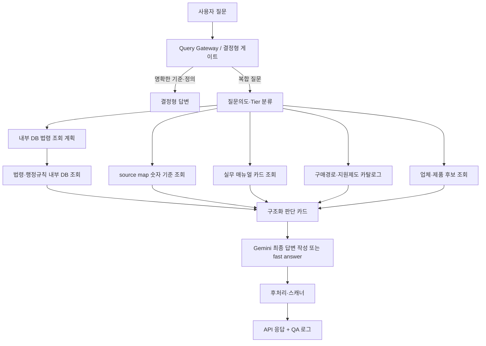

# 질문-답변 생성 로직 종합 점검

작성일: 2026-05-09

## 운영 원칙

챗봇은 법령 설명기가 아니라 지역상품 구매 지원 도구다. 다만 법적 기준은 최신 법령 DB와 `purchase_support_rule_source_map.json`의 검증된 숫자값을 우선한다.

우선순위는 다음과 같다.

1. 최신 법령·행정규칙 DB
2. `source map`의 `numeric_parameters.resolved_value`
3. 구매경로/지역업체 지원제도 카탈로그
4. 실무 매뉴얼 카드 DB
5. 업체·제품 후보 DB/API
6. Gemini의 최종 문장화

## 단계별 흐름

## 실무 매뉴얼 카드 사용 방식

인쇄형 PDF 매뉴얼은 기준금액·비율·시행일이 낡을 수 있으므로 법적 정답 근거로 쓰지 않는다.

이번 보강에서는 PDF를 런타임에 검색하지 않고, 사전에 `app/data/practice_manual_cards.json`으로 압축한다. 런타임에서는 `app/policies/practice_manual_cards.py`가 질문과 계약객체에 맞는 카드만 최대 5개 선택한다.

사용 가능:

- 절차 설명
- 체크리스트
- 실무상 유의사항
- 감사·분쟁 리스크 보조 설명
- 답변의 실무 표현 보강

사용 금지:

- 현재 기준금액
- 현재 비율·점수
- 시행일·특례기간
- 최종 법적 결론

숫자는 반드시 `source map`의 `resolved_value`가 있고 `requires_manual_numeric_verification=false`인 경우에만 답변에 표시한다.

## 응답속도 관점

실무 매뉴얼 PDF는 응답 시점에 열지 않는다.

런타임 비용은 다음 정도로 예상한다.

- 실무카드 JSON 로드: 최초 1회, 이후 캐시
- 질문별 카드 매칭: 메모리 내 키워드 점수화
- LLM에 주입되는 카드: 최대 5개, 짧은 표 형태

따라서 응답지연의 주된 원인이 되지 않는다. 병목은 여전히 업체 후보 조회, 외부 호출, 복합질문에서의 LLM 생성 시간이다.

## 장시간 QA 기준

`scripts/run_server_qa_3h.py`는 다음 항목을 기록한다.

- 질문 원문
- 답변 전문
- HTTP 상태
- 클라이언트 기준 응답시간
- Tier
- 모델명
- 법령 근거카드 수
- 실무 매뉴얼 카드 수
- 내부 DB hit 수
- 외부 MCP fallback 수
- 업체 후보 수
- 자동 경고

결과는 `artifacts/qa/server_3h`에 JSON과 Markdown으로 저장한다.
